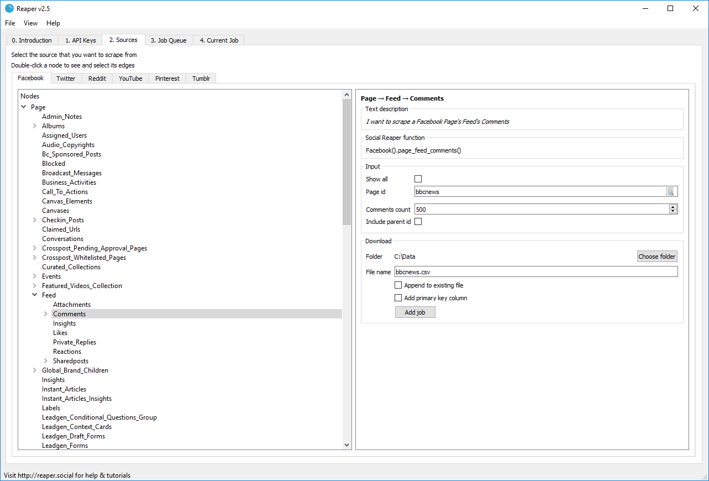

# Reaper
Download social media data - no coding required

# Help & Tutorials
- [Using Reaper](guide.md)
- [Platforms](platforms/list.md)
    - [Facebook](platforms/facebook.md)
    - [Twitter](platforms/twitter.md)
    - [Reddit](platforms/reddit.md)
    - [YouTube](platforms/youtube.md)
    
# Download
- Windows
    - [Installer](https://github.com/ScriptSmith/reaper/releases/download/v2.1.0/reaper-setup.exe)
    - [Standalone](https://github.com/ScriptSmith/reaper/releases/download/v2.1.0/reaper-standalone.zip)
- MacOS High Sierra
    - [Installer](https://github.com/ScriptSmith/reaper/releases/download/v2.1.0/Reaper.pkg)
    - [Standalone](https://github.com/ScriptSmith/reaper/releases/download/v2.1.0/reaper-app.zip)
