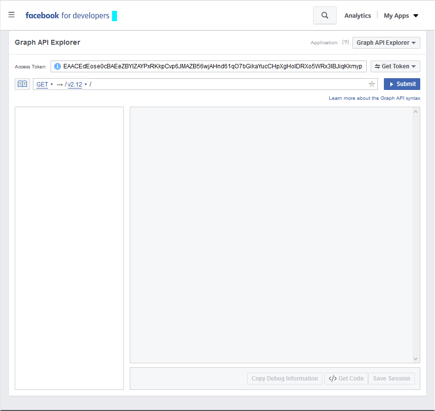
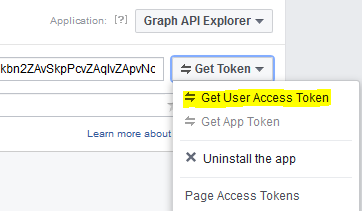
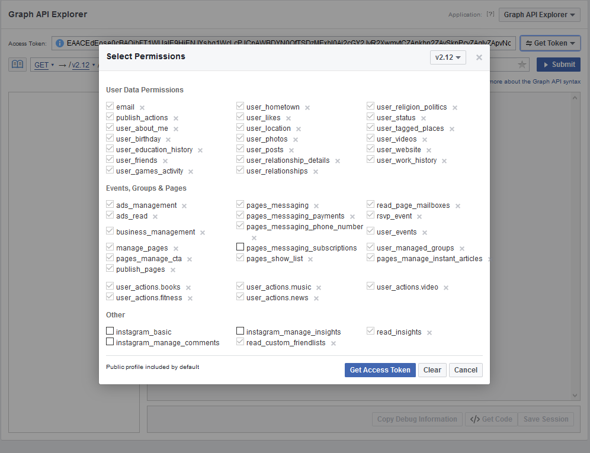
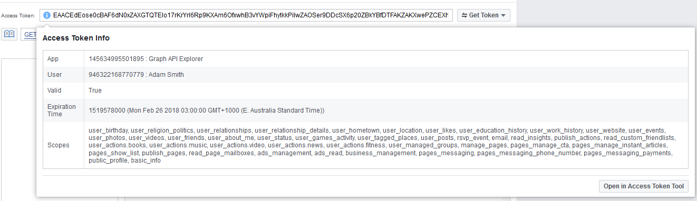
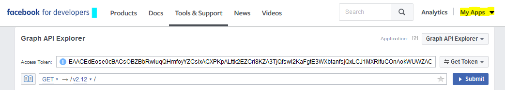
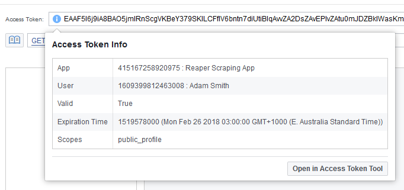

# Facebook
To download data from Facebook, you should make use of the [Facebook Graph API](https://developers.facebook.com/docs/graph-api)

There are restrictions on access to public and private data with the Graph API. These restrictions depend on the type of access token, the API version, and the level of access granted

Reaper uses Graph API v2.9 for maximum compatibility, the latest version is Graph API v2.12

To see a list of all possible endpoints on the Graph API, visit the reference: [https://developers.facebook.com/docs/graph-api/reference/](https://developers.facebook.com/docs/graph-api/reference/)

The reference will also explain what information you can get out of a given endpoint.

## Access tokens
Access tokens are long strings of data that act in a way that's similar to a password. They look like this:

```
EAA0craXsQRIBABIaVSq7qGW9UDWSaWyF9VHPZAlqkG0aUl6EwEp0Az9P73UVGBaZCa09ITPLdg6l8vSaB3P0V1a6VZC9LeZCPhvIu6kaD0iyrCGKakY90msilmZClssu1aPutSMmUs0ibYF7ErIuNCr4ZizbRLiuBZCxXYP7i7Qycim2PREc0i3FuW6QOTaZCcuU4lZC0sbwiyFgZDZD
```

There are three main types of access token:
- User Access Tokens
    - Give you access to user-specific information on behalf of an app
- Page Access Tokens
    - Give you access to information about a page
- App Tokens
    - Give you access to information about an app
    
You can obtain an access token by visiting [https://developers.facebook.com/tools/explorer/](https://developers.facebook.com/tools/explorer/)


This is the Graph API Explorer, an interactive tool that you can use to explore the API and request access tokens.

By default, you can obtain temporary access tokens that last for a short period of time before they expire by clicking `Get Token` then `Get User Access Token`



You can customise the level of access that you want to associate with a given access token by changing its permissions



You can view information about an access token by clicking the blue `i` to its left



## Getting a User Access Token
You can get a User Access Token that is associated with the Graph API Explorer, or with another app.

When scraping public data, it is a good idea to create an app and request a User Access Token for said app. That way, you can extend the expiry time of access tokens and thus not need to create a new token each time you want to scrape something, and you can run more lengthy scraping jobs in Reaper

### Creating an app
From the `My Apps` menu select `Add a New App`



Fill in the details of the new app, then click `Create App ID`

Once you app has been created, navigate back to [https://developers.facebook.com/tools/explorer/](https://developers.facebook.com/tools/explorer/) and click the dropdown menu that says `Graph API Exlporer`


Now select your new application from the list

You can now request a User Access Token just as before. In order to extend the expiry of a newly requested access token, click the blue `i` next to it, and then click `Open in Access Token Tool`



On the new page click `Extend Access Token`. You may be prompted for a password.

<i>You should treat this new long-lasting access token like a password. If someone has access to it, they may be able to view your private information and act on your behalf.</i>

Copy the access token from the page into Reaper


You can now scrape data from Facebook using Reaper

## A note on public and private data

The Graph API gives public access to some useful data such as the posts and comments made on public facebook pages. Page, Group and Event administrators have access to more information such as statistics, and identifying informaton for user's posts, comments and reactions.

If you want to access this private data you can request an access token from an administrator.

You can also ask a Page administrator to give you an 'Analyst' role. An analyst can see information about a page, but they cannot act on its behalf. You can read about this process [here](https://blogs.constantcontact.com/facebook-page-admin-roles/)
