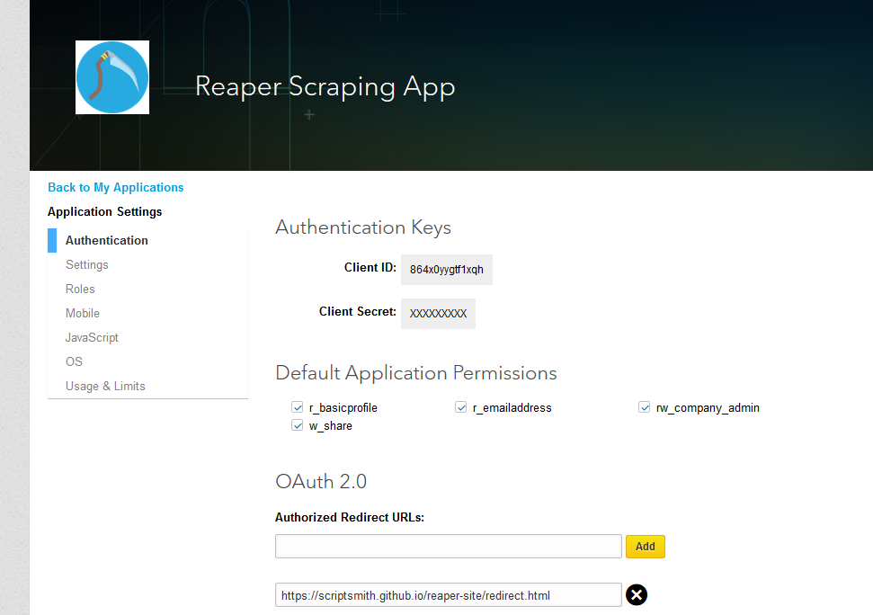
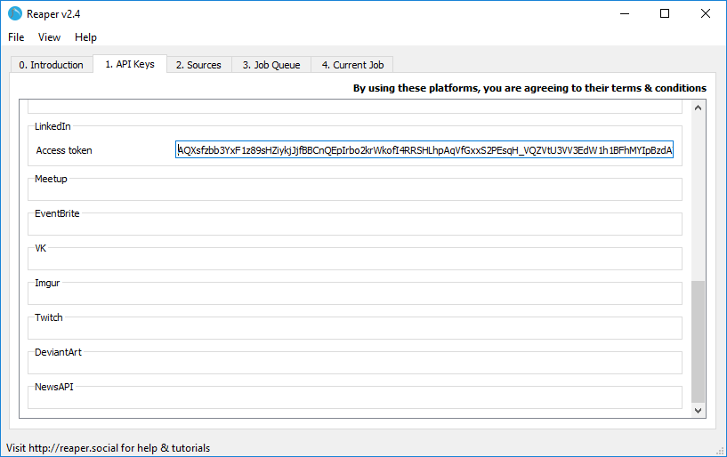

# LinkedIn
To download data from LinkedIn, you should make use of the [LinkedIn API](https://developers.pinterest.com/docs/getting-started/introduction/)

Your own information and some public information is accessible through their API. If you obtain approval from LinkedIn, job listings can be accessed through their API.

To see a list of all possible endpoints on the API, visit the reference: [https://developer.linkedin.com/docs/guide/v2](https://developer.linkedin.com/docs/guide/v2)

The reference will also explain what information you can get out of the available endpoints.

## Access token

To scrape data from the LinkedIn API, you will need to create an app.

Start by signing in to LinkedIn, navigating to [https://www.linkedin.com/developer/apps](https://www.linkedin.com/developer/apps) and creating an app

Once the app has been set up, in the Authorized Redirect URLs textbox, put in *https://scriptsmith.github.io/reaper-site/redirect.html*  and tick all the application permissions

Now, scroll to the top of the page and copy the App ID and App secret into the fields below:

App id: <input type='text' id='appid'>

App secret: <input type='text' id='appsecret'>

Now click this button and accept the request permissions:

<button onclick="auth()">Click me</button>

Copy the code from the page you are redirected to into the field below:

Code: <input type='text' id='code'>

Now click this button:

<button onclick="post()">Click me</button>

When it appears, copy the access token below into Reaper:

*If an error occurs, try request the code again*

