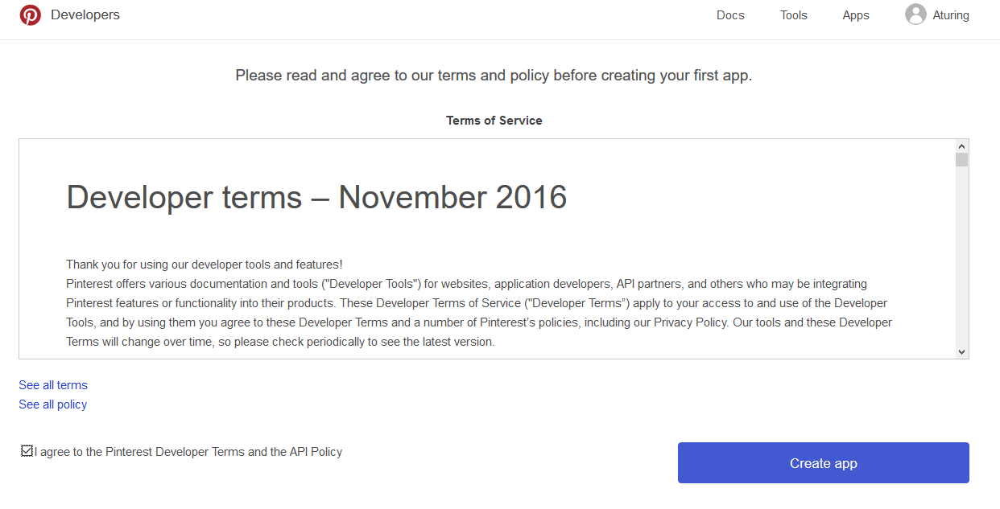
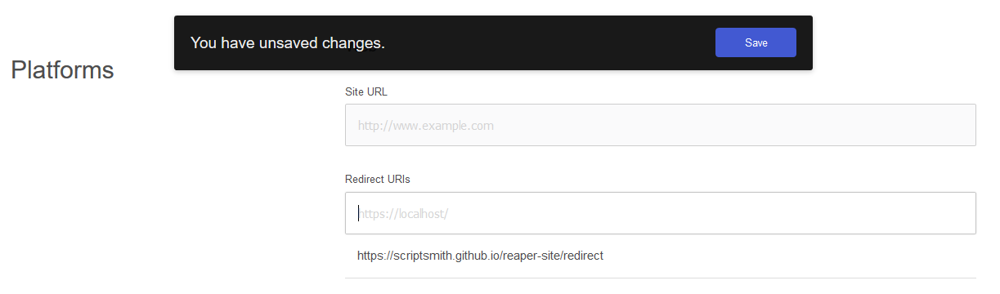
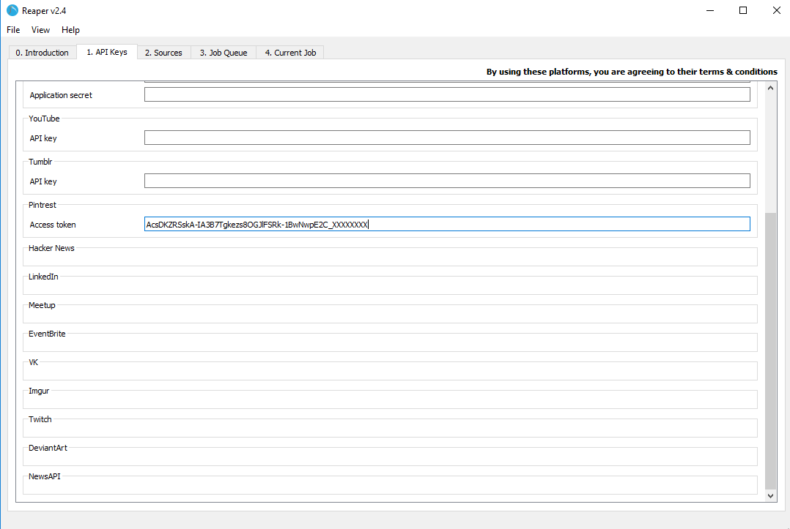

# Pinterest
To download data from Pinterest, you should make use of the [PinterestAPI](https://developers.pinterest.com/docs/getting-started/introduction/)

Most public information on Pinterest can be accessed over the Data API.

To see a list of all possible endpoints on the Data API, visit the reference: [https://developers.google.com/youtube/v3/docs/](https://developers.pinterest.com/docs/api/overview/)

The reference will also explain what information you can get out of the *User*, *Board*, and *Pin* endpoints.

## Access token

To scrape data from the Pinterest API, you will need to create an app.

Start by signing in to Pinterest and navigating to [https://developers.pinterest.com/apps/](https://developers.pinterest.com/apps/) and creating an app

On the next page, in the Redirect URIs textbox, put in *https://scriptsmith.github.io/reaper-site/redirect.html*, press enter, and then save your changes

Now, scroll to the top of the page and copy the App ID and App secret into the fields below:

App id: <input type='text' id='appid'>

App secret: <input type='text' id='appsecret'>

Now click this button and accept the request permissions:

<button onclick="auth()">Click me</button>

Copy the code from the page you are redirected to into the field below:

Code: <input type='text' id='code'>

Now click this button:

<button onclick="post()">Click me</button>

When it appears, copy the access token below into Reaper:

*If an error occurs, try request the code again*

