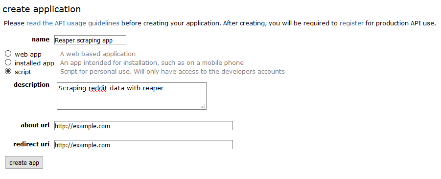
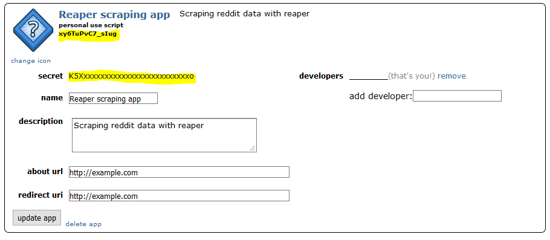
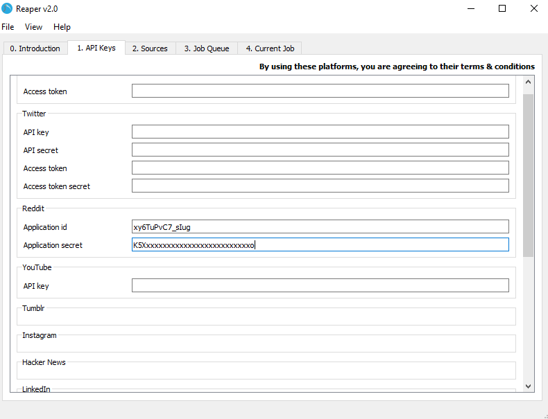

# Reddit
To download data from Reddit, you should make use of the [Reddit API](https://www.reddit.com/dev/api/)

Most public information on Reddit can be accessed over the Reddit API. The only limitation is finding reference to objects that you want to download, as search results and subreddit browsing return a maximum of 1000 threads

To see a list of all the possible endpoints of the Reddit API, visit the documentation: [https://www.reddit.com/dev/api/](https://www.reddit.com/dev/api/)

The Reddit API uses OAuth to authenticate requests. This means you have to register an application with Reddit, and manage the following information:

|Identifier|Purpose|
|----------|-------|
|App id|Identifies the application|
|App secret|The password for the application|

## Creating an app

To create a Reddit app, sign in and navigate to [https://www.reddit.com/prefs/apps/](https://www.reddit.com/prefs/apps/). At the bottom of the page, click the button to create an app.

Fill in the details and click `create app`

On the app page, copy the app id and the secret into Reaper

You can now scrape data from Reddit using Reaper
