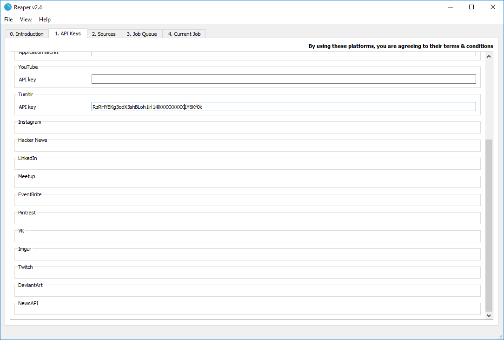

# Tumblr
To download data from Pinterest, you should make use of the [Tumblr API](https://www.tumblr.com/docs/en/api/v2)

Most public data on Tumblr is available over the API.

To see a list of all possible endpoints on the API, visit the reference: [https://www.tumblr.com/docs/en/api/v2](https://www.tumblr.com/docs/en/api/v2)

The reference will also explain what information you can get out of the *Blog* and *Tag* endpoints.

## Access token

To scrape data from the Tumblr API, you will need to create an app.

Start by signing in to Pinterest, navigating to [https://www.tumblr.com/oauth/apps](https://www.tumblr.com/oauth/apps) and creating an app

Once the app is created, scroll to the top of the page and copy the OAuth consumer key into Reaper:

