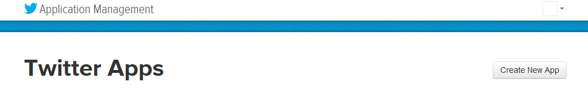
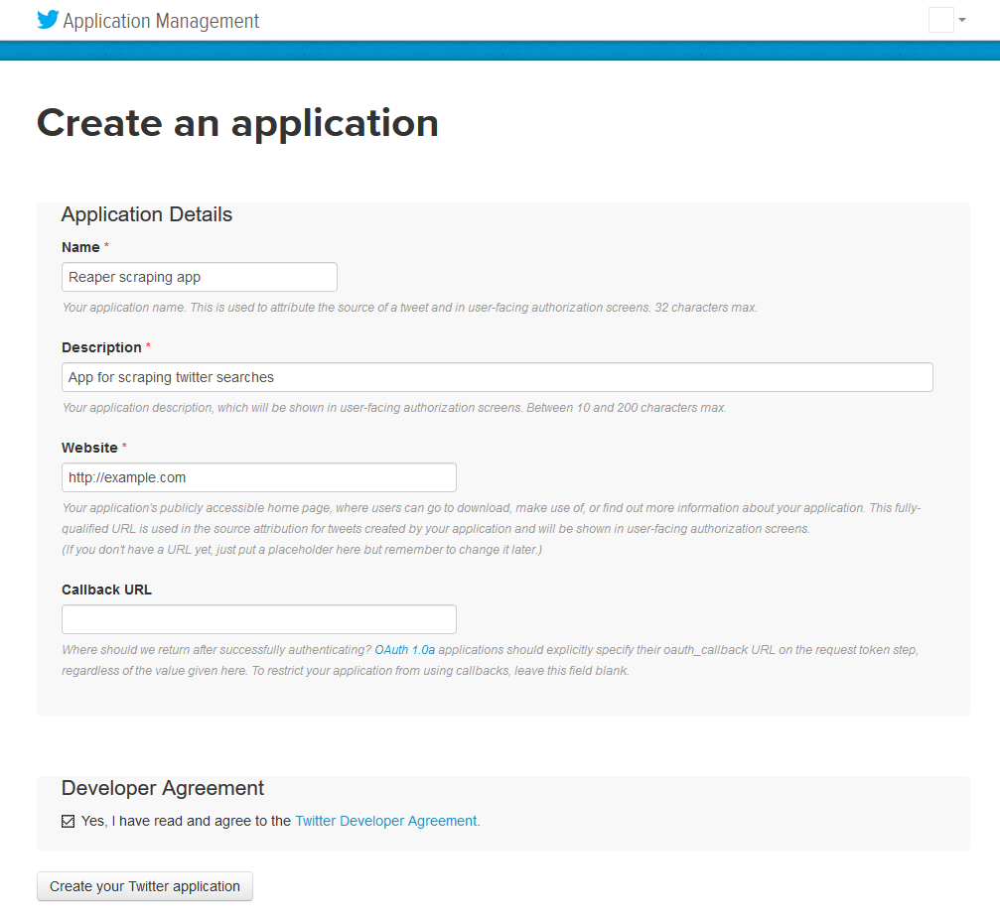
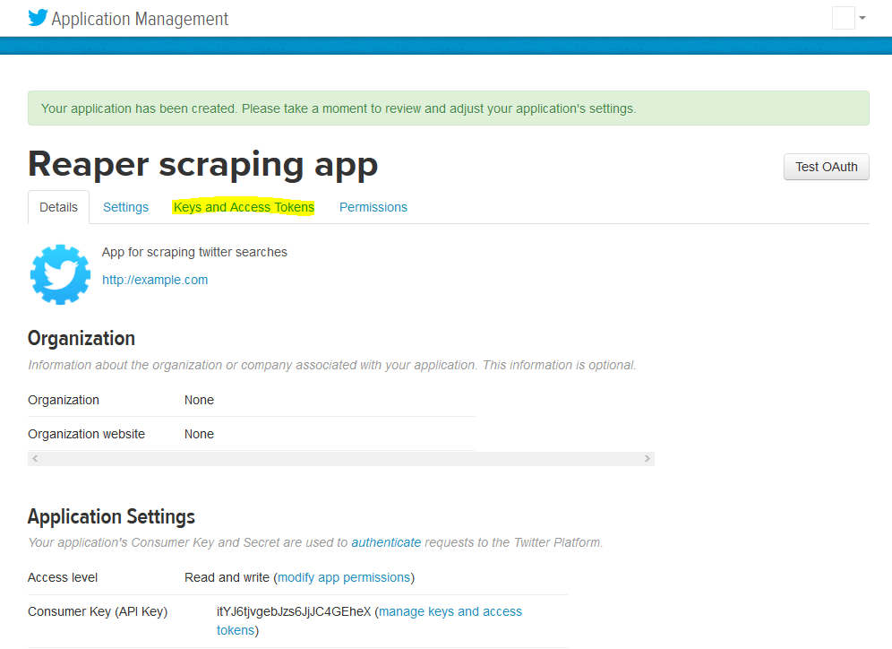
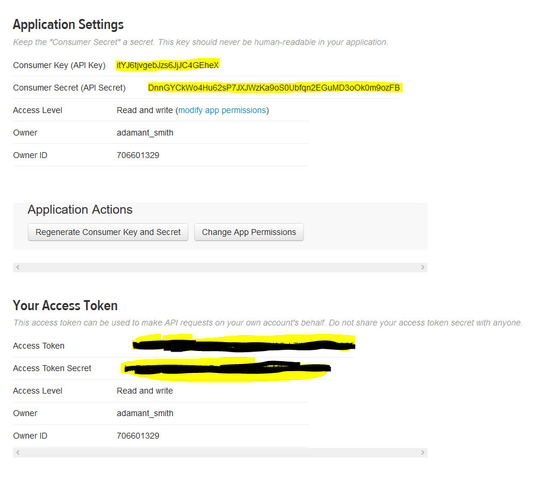
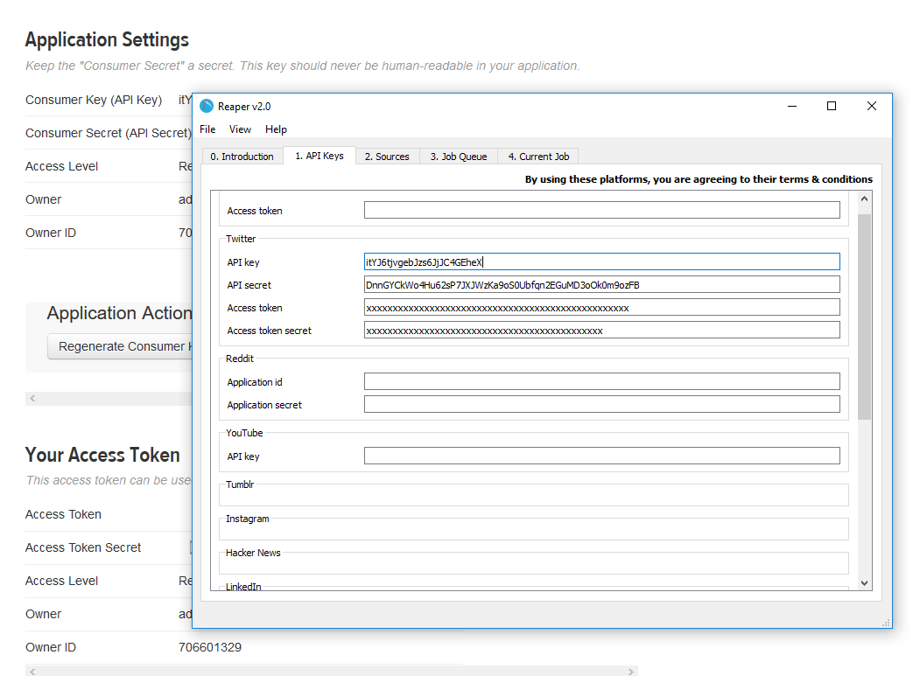

# Twitter
To download data from Twitter, you should make use of the [Twitter Search API](https://developer.twitter.com/en/docs/tweets/search/overview)

There are restrictions to the type and amount of data that you can gather with the Search API based on the payment tier you are using. They are summarised below:

|Category|Product name|Supported history|Query capability|Counts endpoint|Data fidelity|
|--------|------------|-----------------|----------------|---------------|-------------|
|**Standard**|**Standard Search API**|**7 days**|**Standard operators**|**Not available**|**Incomplete**|
|Premium|Search Tweets: 30-day endpoint|30 days|Premium operators|Available|Full|
|Premium|Search Tweets: Full-archive endpoint|Tweets from as early as 2006|Premium operators|Available|Full|
|Enterprise|30-day Search API|30 days|Premium operators|Included|Full|
|Enterprise|Full-archive Search API|Tweets from as early as 2006|Premium operators|Included|Full|

**Reaper only supports the Standard Search API. Note that this means you can only access a sampling of tweets from the last 7 days for a given search. You can also only access the last 3200 tweets for a given user.**

The standard search api makes use of regular operators, here are some examples:

|Operator|Finds Tweets...|
|--------|---------------|
|`watching now`|containing both “watching” and “now”. This is the default operator.|
|`“happy hour”`|containing the exact phrase “happy hour”.|
|`love OR hate`|containing either “love” or “hate” (or both).|
|`beer -root`|containing “beer” but not “root”.|
|`#haiku`|containing the hashtag “haiku”.|
|`from:interior`|sent from Twitter account “interior”.|
|`list:NASA/astronauts-in-space-now`|sent from a Twitter account in the NASA list astronauts-in-space-now|
|`to:NASA`|a Tweet authored in reply to Twitter account “NASA”.|
|`@NASA`|mentioning Twitter account “NASA”.|
|`politics filter:safe`|containing “politics” with Tweets marked as potentially sensitive removed.|
|`puppy filter:media`|containing “puppy” and an image or video.|
|`puppy -filter:retweets`|containing “puppy”, filtering out retweets|
|`puppy filter:native_video`|containing “puppy” and an uploaded video, Amplify video, Periscope, or Vine.|
|`puppy filter:periscope`|containing “puppy” and a Periscope video URL.|
|`puppy filter:vine`|containing “puppy” and a Vine.|
|`puppy filter:images`|containing “puppy” and links identified as photos, including third parties such as Instagram.|
|`puppy filter:twimg`|containing “puppy” and a pic.twitter.com link representing one or more photos.|
|`hilarious filter:links`|containing “hilarious” and linking to URL.|
|`puppy url:amazon`|containing “puppy” and a URL with the word “amazon” anywhere within it.|
|`superhero since:2015-12-21`|containing “superhero” and sent since date “2015-12-21” (year-month-day).|
|`puppy until:2015-12-21`|containing “puppy” and sent before the date “2015-12-21”.|
|`movie -scary :)`|containing “movie”, but not “scary”, and with a positive attitude.|
|`flight :(`|containing “flight” and with a negative attitude.|
|`traffic ?`|containing “traffic” and asking a question.|

The Search API uses OAuth to authenticate requests. This means you have to register an application with Twitter, and manage the following information:

|Identifier|Purpose|
|----------|-------|
|Consumer key|Identifies the application|
|Consumer secret|The password for the application|
|Access token|A user-specific identifier for the application|
|Access token secret|A user-specific password for the application|

## Getting keys
Before you can create a Twitter app, you need to be signed into an account that is linked to a phone number. Visit [https://twitter.com/settings/devices](https://twitter.com/settings/devices) and ensure that your phone number is listed. If not, add and verify it.

To create an app. Navigate to [https://apps.twitter.com](https://apps.twitter.com) and click `Create New App`

On the next page, fill in the details and click `Create your Twitter Application`

On the following page, click the `Keys and Access Tokens` tab

At the bottom of that page (you may need to scroll down), click `Create my access token`

You then need to copy the fields below into Reaper

You can now scrape data from Twitter using Reaper
