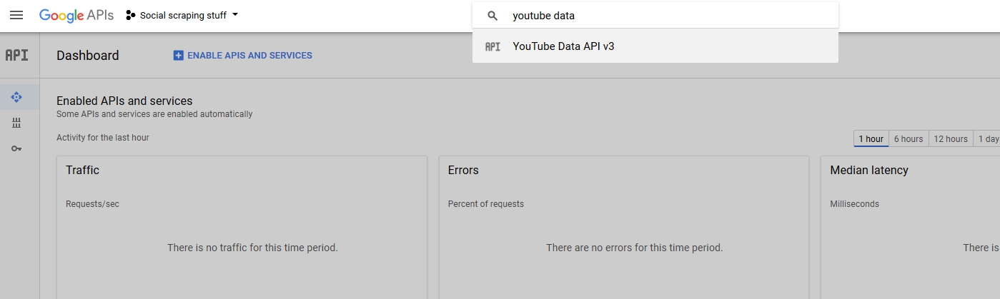
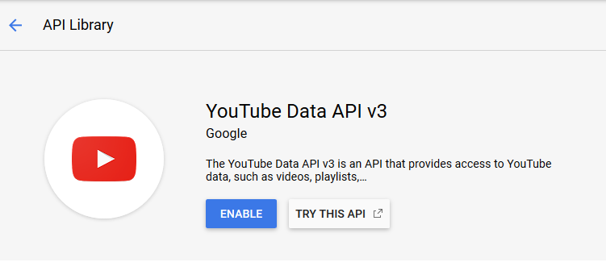
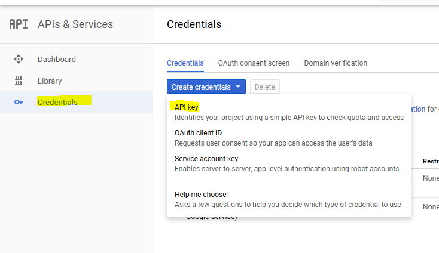
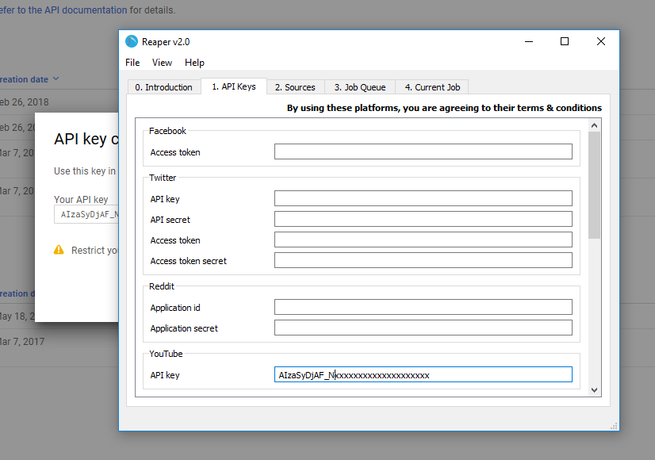

# YouTube
To download data from YouTube, you should make use of the [YouTube Data API](https://developers.google.com/youtube/v3/)

Most public information on YouTube can be accessed over the Data API. The only limitation is that there is a limit to the number of free queries you can perform per month.

To see a list of all possible endpoints on the Data API, visit the reference: [https://developers.google.com/youtube/v3/docs/](https://developers.google.com/youtube/v3/docs/)

The reference will also explain what information you can get out of a given endpoint.

## Access key

To scrape data from the Data API, you will need to create a Google Developer Project.

Start by navigating to [https://console.developers.google.com/](https://console.developers.google.com/) and creating a new project.

Once you've created the project, wait until its ready, then select it from the dropdown at the top

Once you've selected you new project, search for and select `YouTube Data API v3`

Click the button to enable the YouTube Data API

If you are prompted to create credentials, then do so. If not, click the `Credentials` tab on the left, click the `Create credentials` button, then click `API key`

Then copy your API key into Reaper

You can now scrape data from YouTube using Reaper