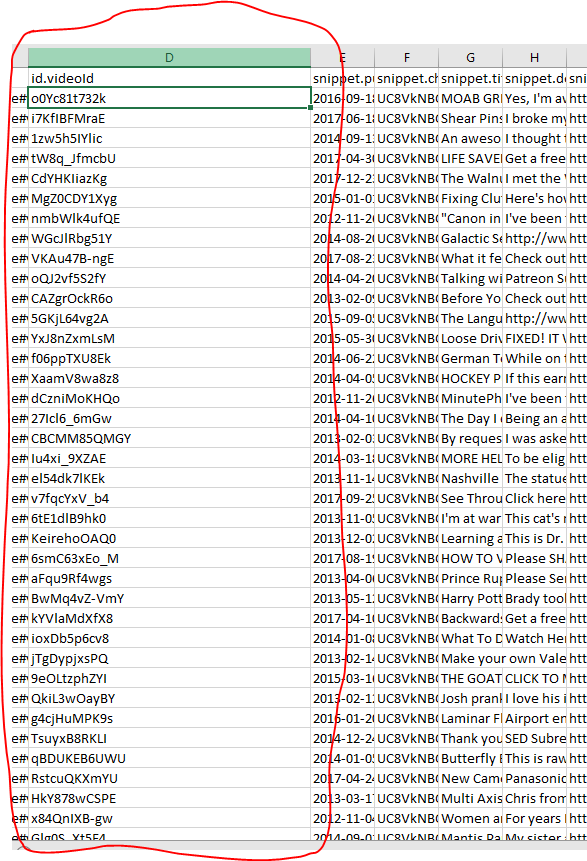
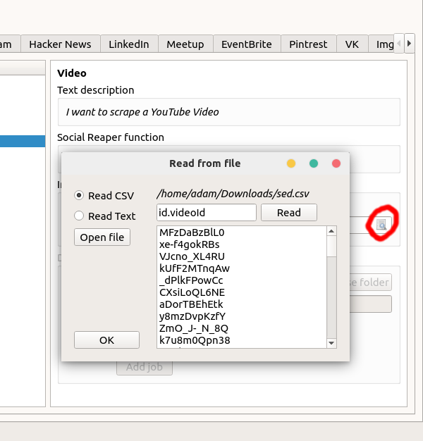
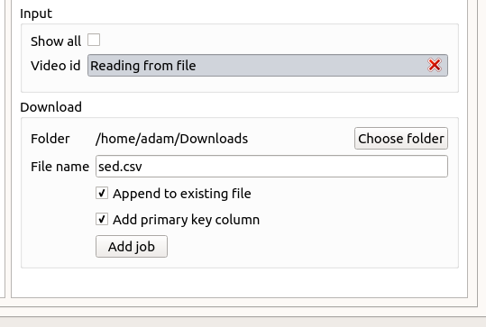
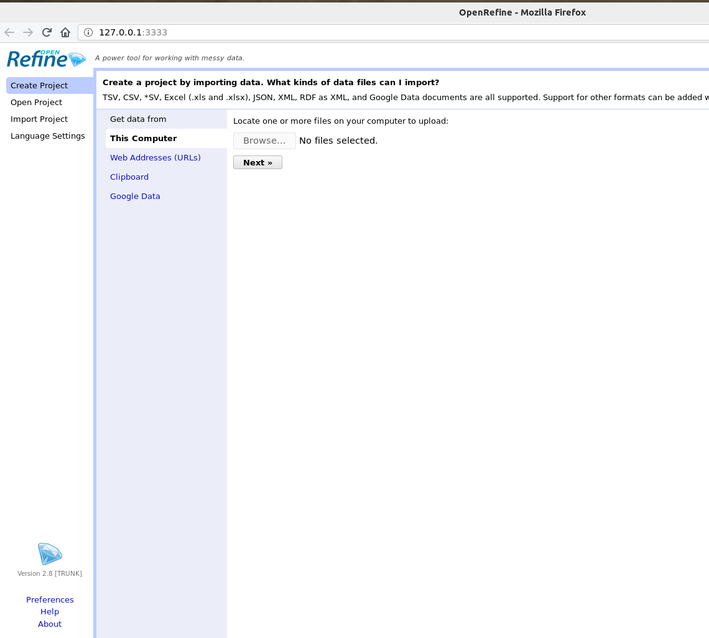

# Workshop 2: Data cleaning and CSV files
Reaper v2.3 has been released. Please download it from [http://reaper.social](http://reaper.social) and use it to complete the tasks below.

## JSON and CSV

When Reaper downloads data from social media platforms, it makes many requests over the Internet for JSON data. JSON stands for JavaScript Object Notation and looks something like this:

```json
{
   "status": 200,
   "message": "OK",
   "response":[
      {
         "a": 1,
         "b": 2,
         "c": {
            "d": 3,
            "e": 4
         },
         "f": [5, 6, 7]
      },
      {
         "a": 8,
         "b": 9,
         "c": {
            "d": 10,
            "e": 11
         },
         "f": [12, 13, 14]
      }
   ]
}
```

Reaper then processes the responses to the requests, and saves them as a single CSV file. CSV stands for Comma-Seperated Values.

When the above data from Reaper is saved, the contents of the file looks like this:

```csv
a,b,c.d,c.e,f.0,f.1,f.2
1,2,3,4,5,6,7
8,9,10,11,12,13,14
```

Which can be displayed in table form:

|a|b|c.d|c.e|f.0|f.1|f.2|
|-|-|---|---|---|---|---|
|1|2|3|4|5|6|7|
|8|9|10|11|12|13|14|

*Extra task: See if you can figure out how the JSON is translated to CSV. How do the column names work?*

### Task 1
Consider the following data:

```json
[
   {
      "from":{
         "name":"McDonald's",
         "id":"179866158722992"
      },
      "message":"Aussies love their coffee, so what could be more true blue than giving one customer from every McCafé free coffee for a year? All you have to do is buy any McCafé beverage for your chance to win. Hurry, this birthday present won’t last forever!",
      "created_time":"2018-03-04T23:30:00+0000",
      "comments":{
         "summary":{
            "order":"ranked",
            "total_count":57,
            "can_comment":true
         }
      },
      "id":"179866158722992_1717101788332747"
   },
   {
      "from":{
         "name":"McDonald's",
         "id":"179866158722992"
      },
      "message":"The Ute and McCafé have more in common than you’d think, because they were both invented right here in Australia! Celebrate our 25th birthday with a delicious McCafé coffee today.",
      "created_time":"2018-02-27T23:30:00+0000",
      "comments":{
         "summary":{
            "order":"ranked",
            "total_count":146,
            "can_comment":true
         }
      },
      "id":"179866158722992_1708684862507773"
   }
]
```
What would go in the table below?

|from.name|from.id|message|created_time|comments.summary.order|comments.summary.total_count|comments.summary.can_comment|id|
|-|-|-|-|-|-|-|-|
|<input type="text">|<input type="text">|<input type="text">|<input type="text">|<input type="text">|<input type="text">|<input type="text">|<input type="text">|
|<input type="text">|<input type="text">|<input type="text">|<input type="text">|<input type="text">|<input type="text">|<input type="text">|<input type="text">|

## CSV properties
CSV files contain one line of text per record of data (except when they don't), which are seperated by commas for each column (except when they aren't), and the first row represents the column headings (except when it doesn't).

Confused? Lets break that down.

**1. CSV files contain one line of text per row of data**

This is true in most cases. Consider the following file:

```CSV
name,phone
"blake",55947385
"rosie",58203458
```

Which translates to:

|name|phone|
|-|-|
|blake|55947385|
|rosie|58203458|

But this CSV file:

```CSV
name,phone,address
blake,55947385,"45 Gailey Road
St Lucia"
rosie,58203458,"35 Sir Fred Schonell Drive
St Lucia"
```

Translates to:

|name|phone|address|
|-|-|-|
|blake|55947385|45 Gailey Road<br>St Lucia|
|rosie|58203458|35 Sir Fred Schonell Drive<br>St Lucia|

When we want to save text that includes line-breaks to a CSV file, we wrap the column contents in double quotes `""`

Also note that `blake` and `rosie` are wrapped in commas in the first file but not in the second file, yet the representation is still the same. Most CSV interpreters will automatically ignore double quotes at the start and end of a column.

But what if I want a table like the one below?

|name|phone|address|message|
|-|-|-||
|blake|55947385|45 Gailey Road<br>St Lucia|08:34AM - "I won't be home until 4:00"|
|rosie|58203458|35 Sir Fred Schonell Drive<br>St Lucia|04:13PM - "Don't forget to pick up milk"|

How can we save that as a CSV file? Like this:

```CSV
name,phone,address,message
blake,55947385,"45 Gailey Road
St Lucia","08:34AM - ""I won't be home until 4:00"""
rosie,58203458,"35 Sir Fred Schonell Drive
St Lucia","04:13PM - ""Don't forget to pick up milk"""
```
When we want double quotes to not be ignored, we wrap them in double quotes


**2. Commas seperate each column**

Similar logic is applied when seperating columns.

To have a table like this:

|name|sentence|
|----|--------|
|blake|I like cats, they're cute|
|rosie|I like dogs, they're fun|

We cannot simply have a csv file like this:

```CSV
name,sentence
blake,I like cats, they're cute
rosie,I like cats, they're fun
```

Because that table would actually be this:

|name|sentence| |
|----|--------|-|
|blake|I like cats| they're cute|
|rosie|I like dogs| they're fun|

Instead, we wrap the text in double quotes:

```CSV
name,sentence
blake,"I like cats, they're cute"
rosie,"I like cats, they're fun"
```

**3. The first row is for column headings**

When saved as CSV files, the following tables are exactly the same:

|name|phone|
|-|-|
|blake|55947385|
|rosie|58203458|

<table>
<tr><td>name</td><td>phone</td></tr>
<tr><td>blake</td><td>55947385</td></tr>
<tr><td>rosie</td><td>58203458</td></tr>
</table>

CSV files do not need column headings, and there is no way to tell whether the first line of a CSV file is a column heading row, or a normal row. The program you are using may give you the option to choose.

### Task 2

Create a CSV file that describes the following people:

Maggie Smith was born on the 28th of December, 1934. She is an actress. She is 1m, 65cm tall.

Bill Withers was born on 04/07/1938. He is a singer / songwriter.

What columns shoud you use?

If using a Mac, you can use textEdit, if using windows, you can use notepad.

*Note for mac users: in textedit you need to enable raw text mode (`Command` + `Shift` + `t`) and disable smart quotes ( Edit -> Substitutions -> Uncheck smart quotes)*

Please don't try to open the files in Excel, as Excel will sometimes break valid CSV files. Never assume data you see in Excel is an accurate representation of the data in a file.

## Text files
Not all files that describe text are the same. Some files like word documents are a mix of markup and binary data. Raw text files are made up of just what you'd think, raw text.

You may have heard that everything on computers is just 1s and 0s, which is true. In text files, these 1s and 0s represent binary integers. For example, in ASCII the decimal number `97` is `1100001` in binary and represents `a`.

##### Note
Binary numbers are numbers in base 2, the numbers you use day to day are base 10.

|Binary|Decimal|
|------|-------|
|0|0|
|1|1|
|10|2|
|11|3|
|100|4|
|101|5|
|110|6|
|111|7|
|...|...|

ASCII is one of the first standards for 'character encoding' and was spawned from the same standards used to communicate through the telegraph. ASCII text has a bit width of 7. This means that every ASCII character is represented as a binary number between `0000000` and `1111111`. You can see them all in an ASCII table:

 

 With a bit width of 7, you can only store a maximum of 128 characters (although note that some characters don't actually look like characters at all, you can read about what they do and how to type them on [wikipedia](https://en.wikipedia.org/wiki/ASCII#Control_characters)). This means that we can't use ASCII to store characters from other languages, or more complex characters like emoji - yes, emoji are characters.

 The other two most common encoding standards come from Unicode: UTF-8 and UTF-16. These encodings are more complicated and can store hundreds of thousands of characters.

 When you try and open text files in software on your computer, it either has to guess which type of encoding you are using (Excel may do this), or you will specify it. When Reaper saves its data to a CSV file, it encodes it as UTF-8. If the software you're using to read the CSV files tries to interpret it as ASCII, not UTF-8, you may end up processing incorrect data as part of your analysis.

### Task 3
Use the ASCII table above to read the following binary data:

`01100011 01101111 01101101 01110101 00110011 00110001 00110010 00110000`

## Reaper

You can use text as an input into Reaper.

Previously you have been downloading data by giving Reaper a single node to look into (like the YouTube video id `o0Yc81t732k`) . You can also use Reaper to read a list of nodes from a file to queue up and download.



Reaper can read plain UTF-8 text files, as well as CSV files. This means that you can download something from Reaper, and then use that data as input to download more data.

To do this, click the spyglass button in Reaper and read data from the window that opens.



*id.videoId* is the case-sensitive name of a column in a CSV file

You can also append the data to an existing file, and add the data you're reading input from as a new column called primary_key



This means that you can create a single big file from multiple inputs, and include the id of the input node for each row of data.

If you want to create one big file: give the file an ordinary name.

If you want to create many smaller files: give the file a name containing the text `{key}` which will be replaced by whatever is being read from the input file.

## OpenRefine

OpenRefine is a data cleaning and transformation tool formerly developed by Google which is now free, open source software.

Please follow the instructions [here](http://openrefine.org/download.html) to download and run OpenRefine 2.8. You may need to install Java JRE if you have not already

When it has been launched, it will open a window in your browser that looks like this:



Now, watch the following videos to see some demonstrations of common uses of OpenRefine:

Note that these are examples of workflows with messy data. Your data will be more structured, but any user-submitted content will still be messy.

Additionally, in this course you are not expected to do any programming like in the videos. You are welcome to learn, but it is not a requirement. If we do need you to use code, we will supply it and you will be able to copy and paste it into OpenRefine.

<iframe width="560" height="315" src="https://www.youtube.com/embed/B70J_H_zAWM" frameborder="0" allow="autoplay; encrypted-media" allowfullscreen></iframe>

<iframe width="560" height="315" src="https://www.youtube.com/embed/cO8NVCs_Ba0" frameborder="0" allow="autoplay; encrypted-media" allowfullscreen></iframe>

Then have a quick read through each of the following pages to learn how to use OpenRefine. You can refer back to them when completing the final tasks

- [https://github.com/OpenRefine/OpenRefine/wiki/Importers](https://github.com/OpenRefine/OpenRefine/wiki/Importers)
- [https://github.com/OpenRefine/OpenRefine/wiki/Faceting](https://github.com/OpenRefine/OpenRefine/wiki/Faceting)
- [https://github.com/OpenRefine/OpenRefine/wiki/Cell-Editing](https://github.com/OpenRefine/OpenRefine/wiki/Cell-Editing)
- [https://github.com/OpenRefine/OpenRefine/wiki/Clustering](https://github.com/OpenRefine/OpenRefine/wiki/Clustering)
- [https://github.com/OpenRefine/OpenRefine/wiki/Column-Editing](https://github.com/OpenRefine/OpenRefine/wiki/Column-Editing)
- [https://github.com/OpenRefine/OpenRefine/wiki/Understanding-Expressions](https://github.com/OpenRefine/OpenRefine/wiki/Understanding-Expressions)
- [https://github.com/OpenRefine/OpenRefine/wiki/Exporters](https://github.com/OpenRefine/OpenRefine/wiki/Exporters)
- [https://github.com/OpenRefine/OpenRefine/wiki/History](https://github.com/OpenRefine/OpenRefine/wiki/History)

Finally, after you've created projects for the tasks below, try exploring all the options available to you when hovering over the arrows next to columns.

### Task 4

#### Task 4a
1. Use Reaper to download the last 500 posts made on the Mcdonalds Australia Facebook page
2. Import the data into OpenRefine
3. Split the `created_time` column by length into 1 column containing the year and month, and another into the rest of the time data
4. Remove all the columns except the column containing the year and month, and the `message` column
5. Transform the message text to lower-case
6. Save it as an excel file called maccas_posts.xlsx

#### Task 4b
1. Use Reaper to download 200 HTML comments based on relevence from the last 50 videos on the YouTube channel "UC8VkNBOwvsTlFjoSnNSMmxw" to a single file. Note that you may have to download one set of data before you can create the second. Ensure that each comment has a column describing what video it is from
2. Import the data into OpenRefine
3. Identify the column `snippet.topLevelComment.snippet.textOriginal` containing the HTML text of each comment, and tranform the cells to unescape HTML entities
4. Cluster all the comments based on their text. Only cluster comments with more than 3 Rows in Cluster
5. Do a Custom Tabular Export to download a CSV file containing only the columns for the topLevelComment's author name, like count, and original text
